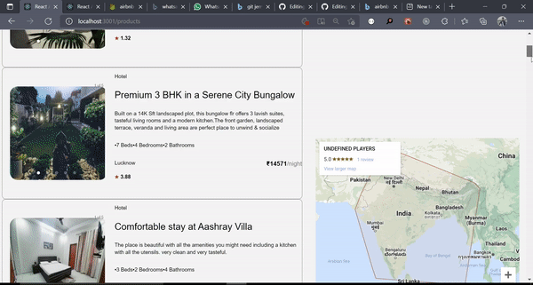
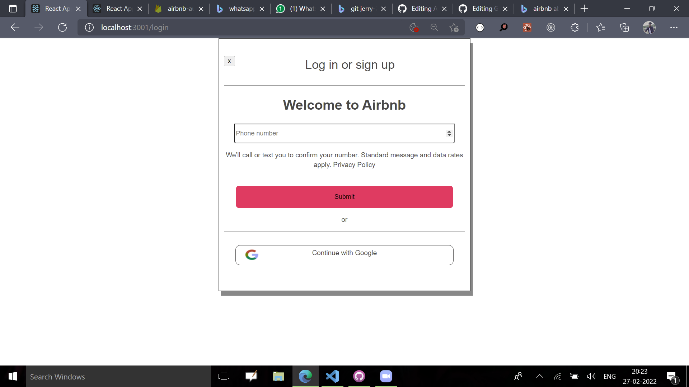
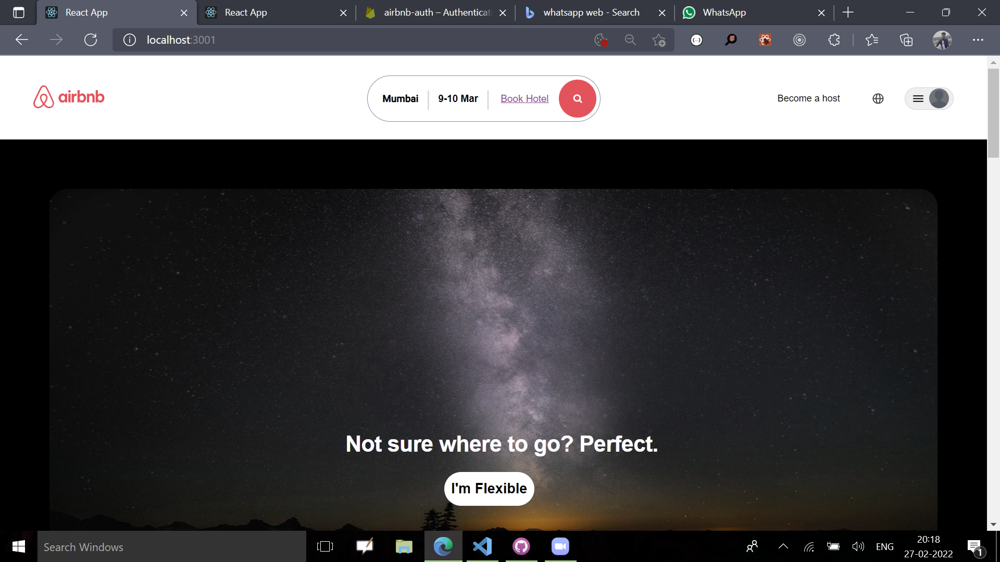
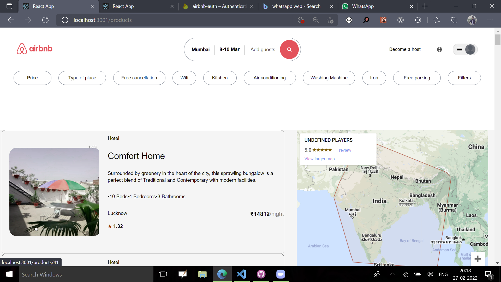
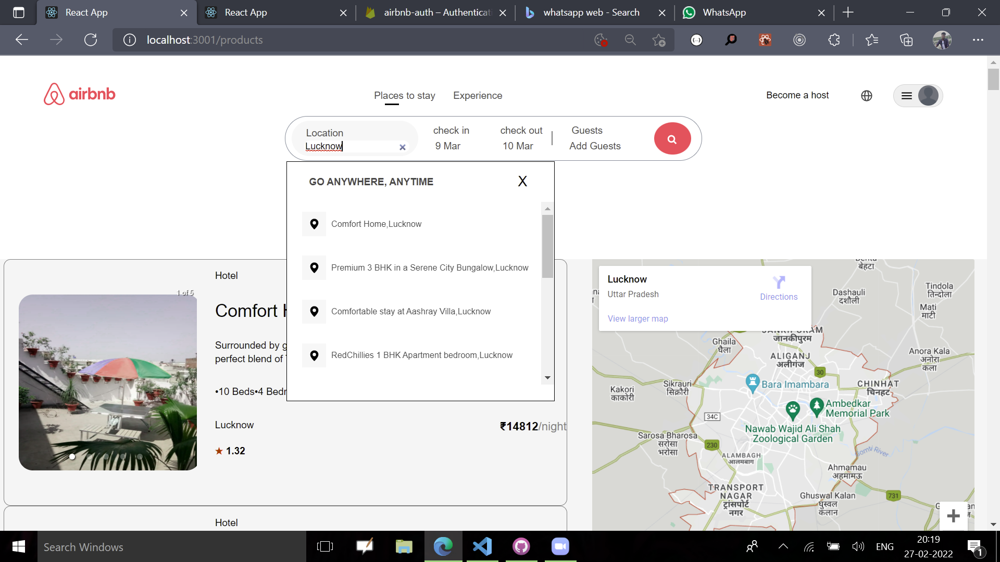
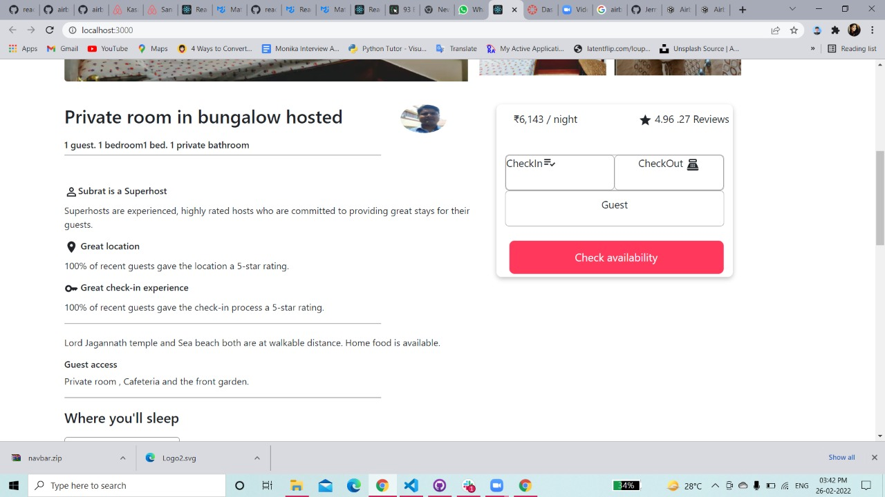
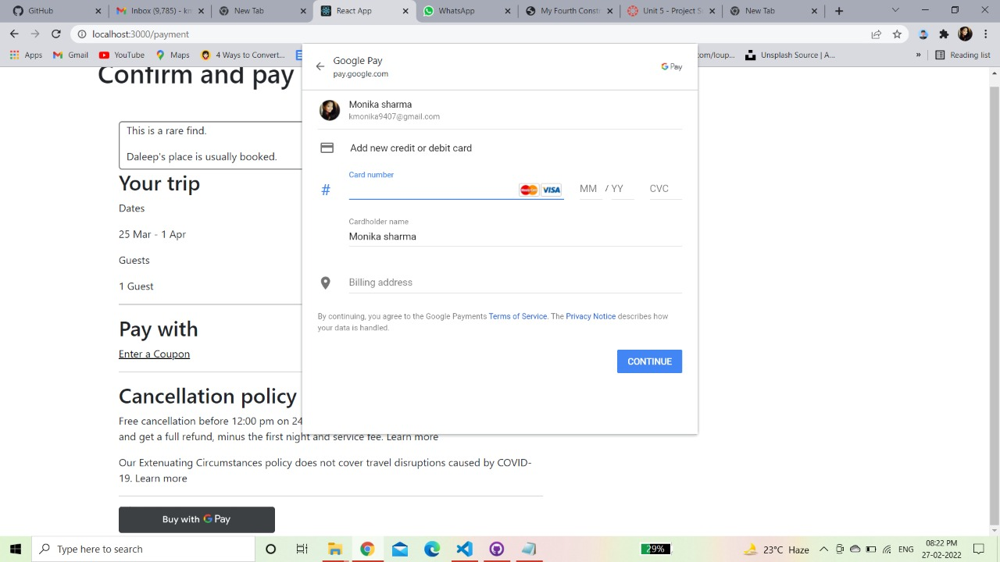

# Airbnb-Clone
Airbnb, Inc. is an American company that operates an online marketplace for lodging, primarily homestays for vacation rentals, and tourism activities
# Preview

# Features

User Authentication 

Home

Hotel List , Filters

Hotel Lists search by Location and Map

Hotel Details

Cart and Payment Methods

Payment Successfull

<!-- 
Payment Successfull

 -->

# Getting Started

<h4>Want to run in your local Machine? Great!<h4>

<h4>To run, follow these steps:</h4>

  <ul>
    <li>Clone my repository https://github.com/Jerry-29/Airbnb-Clone</li>
    <li>Open that code in your Code Editor</li>
    <li>Run 'npm install'</li>
    <li>Run 'npm start'</li>
    <li>React will open project at http://localhost:3000/
    <li>Thats all !</li>
  </ul>
  
  # TechStacks
  <ul>
  <li>React</li>
  <li>Redux</li>
  <li>Javascripts</li> 
  <li>HTML</li>
  <li>CSS</li>
  <li>Firebase</li> 
  </ul>
  
  # Developers
<ul>
  <li><a href="https://github.com/Jerry-29">Govind Singh</a>
  </li>
   <li>
     <a href="https://github.com/Rohit8483">
     Rohit
       <a/>
  </li>
   <li>
     <a href="https://github.com/monika-4oop">
     Monika
     </a>
  </li>
   <li>
     <a href="https://github.com/gopala1995">
     Gopala
     </a>
  </li>
   <li>
     <a href="https://github.com/shashifw11">
     Shashi Kumar
     </a>
  </li>
  </ul>
